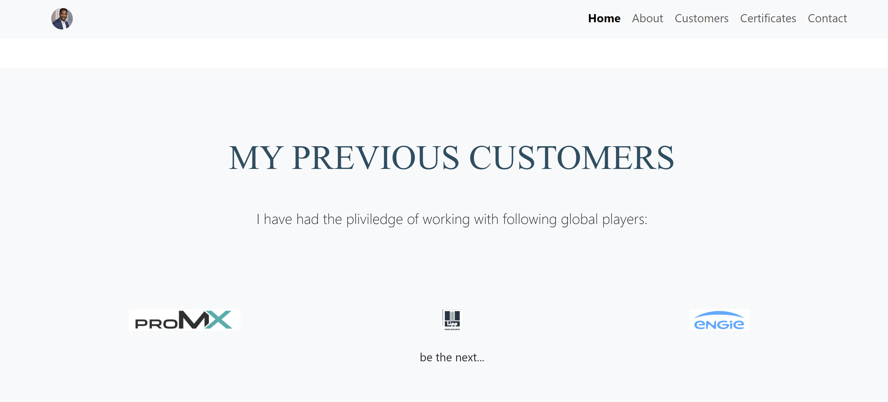

# Vital's portfolio Website -  PP1-HTML-CSS-Vital


Vital's portfolio Website is intended to give important information to professionals and everyone alse who might be interested in hiring Vital as their potential IT project manager or software developer for their Projects.

Users of this website will get most of the information about Vital as their ideal candidate, about me, my crediantials/Portfolio, my contact info, and they can also subscribe to my newsletter if they wish so. Most of the GDPR applies.
Check my website and get opportunity to work with me!

Visit the live site: [The PP1-HTML-CSS-Vital](https://vinsengi.github.io/PP1-HTML-CSS-Vital/)


## Features 

### Site wide
* Navigation Menu
    * Contains links to the Home, About, Customers, Certificates and Contact pages (sections) and will be responsive on all standard devices.
    * This will allow users to easily navigate between the pages within the site on any standard size device. 


* Footer
    * This will contain icons as links to social media websites that will open in new tabs. Icons will be accessible to the visually impaired who may be using a screen reader, by the use of aria labels.

    * This will allow the user to follow Vital on various social media where they can get more up to date information that may not be displayed on the website. The contact information will allow the user to contact Vital directly.


* Favicon
    * A site wide favicon (This is a noraml vital profile picture resized down and rounded to mimik a favicon) will be implemented with vital's profile picture in a form of a circle.
    * This will provide an image in the the tabs header to allow the user to easily identify the website if they have multiple tabs open.


* 404 Page
    * A 404 page will be implemented and will display if a user navigates to a broken link.
    * The 404 page will allow the user to easily navigate back to the main website if they direct to a broken link / missing page, without the need  of the browsers back button.


### Landing Page
* Landing page image
    * This will be a collection of favourite images from some of 'Taco's Travels. Images will change on a timer. 
    * This will help to immediately show the user what the website is about and help to animate the page. 


* Website information on Vial's website
    * Information about Vital and the websites purpose including an image of Vital.
    * This information lets the user know what the site is about. 


* This section will provide principal values that Vital believes in especially when it comes to project management profession.


### Customers section
* Customers
    * This section serves as testimonials of other world playrs that Vital has worked with as in to give confidency to the potential customer/business partner.




### Certificates
* to fullfill all the requirements...
    * This sections containing 3 sample photos from certificates. They aim to give the user another high level overview of proof for my continious learning and growth mindset, learn it all! 
    


### Contact
* Contact form
    * A contact form will be implemented to allow users to contact Vital. The form will consist of the following fields and attributes: 
        *Full Name (required, type=text)
        * Phone number (required, type=text)
        * Email (required, type=email)
        * Message (required, type=textarea)
        * Send Button
    * On successful submission of the contact form, the user will be navigated to contact.html displaying a success message.
    * This will allow user to contact Vital if they have any queiries about him.


### Not shown Features on the navigation menu

* Sucess form, not on navigation, it shows up only on successful submission of the contact form
* 404 - Not found form


### Features Left to Implement

* As a future enhancement, the contact form will be updated with javascript to send an email to vital with the contact information.

* Fix the carousel so that its height remains same regardless of image's height.

* A downloadable pdf Resume will be made possile later. As per current deployment, the resume is a simple HTML and CSS webpage.

## Design

### Wireframes
<br>
Home page
<br><br>


<br><br>
Contact form successful submission page.
<br><br>


Adventures page
<br><br>


Gallery page
<br><br>


404 page
<br><br>


<br><br><br><br>


## Technologies

* HTML
    * The structure of the Website was developed using HTML as the main language.
* CSS
    * The Website was styled using custom CSS in an external file.

* CSS - Framework - ![Bootstrap] (https://getbootstrap.com/)
    * The Website was styled using custom CSS in an external file.
* Gitpod
    * The website was developed using Gitpod IDE
* GitHub
    * Source code is hosted on GitHub and delpoyed using Git Pages.
* Git 
    * Used to commit and push code during the development opf the Website
* Font Awesome
    * Icons obtained from https://fontawesome.com/ were used as the Social media links in the footer section. 
* Tinyjpg
    * https://tinyjpg.com/ was used to reduce the size of the images used throughout the website
* Favicon.io
    * favicon files were created at https://favicon.io/favicon-converter/  and i used some of my own pictured resized down.
* balsamiq
    * wireframes were created using balsamiq from https://balsamiq.com/wireframes/desktop/#


## Testing 

### Responsiveness

All pages were tested to ensure responsiveness on screen sizes from 320px and upwards as defined in [WCAG 2.1 Reflow criteria for responsive design](https://www.w3.org/WAI/WCAG21/Understanding/reflow.html) on Chrome, Edge, Firefox and Opera browsers.

Steps to test:

1. Open browser and navigate to [Vital's website](https://vinsengi.github.io/PP1-HTML-CSS-Vital/)
2. Open the developer tools (right click and inspect)
3. Set to responsive and decrease width to 320px
4. Set the zoom to 50%
5. Click and drag the responsive window to maximum width

Expected:

Website is responsive on all screen sizes and no images are pixelated or stretched.
No horizontal scroll is present.
No elements overlap.

Actual:

Website behaved as expected with the exception of switching to landscape view in Mozilla Firefox. Details can be found in [Unfixed Bugs](#Unfixed-Bugs)

Website was also opened on the following devices and no responsive issues were seen:

- Dell monitor (X-large monitor)
- Lenovo Thinkpas x1 yoga (large screen)
- iPhone 13 pro max (small screen)
- ipad 12 pro (Medium screen)

### Accessibility

[Wave Accessibility](https://wave.webaim.org/) tool was used throughout development and for final testing of the deployed website to check for any aid accessibility testing.

Testing was focused to ensure the following criteria were met:

- All forms have associated labels or aria-labels so that this is read out on a screen reader to users who tab to form inputs
- Color contrasts meet a minimum ratio as specified in [WCAG 2.1 Contrast Guidelines](https://www.w3.org/WAI/WCAG21/Understanding/contrast-minimum.html)
- Heading levels are not missed or skipped to ensure the importance of content is relayed correctly to the end user
- All content is contained within landmarks to ensure ease of use for assistive technology, allowing the user to navigate by page regions
- All not textual content had alternative text or titles so descriptions are read out to screen readers
- HTML page lang attribute has been set
- Aria properties have been implemented correctly
- WCAG 2.1 Coding best practices being followed

#### Wave Testing Results:

* Home page testing:


* About Section


* Customers Section


* Certificates Section


* Contact Section


### Lighthouse Testing

#### Tetsing results images:
* Home section testing results:


* Home section testing results -iphone 14 pro Max:


* About section testing results:


* Customers section testing results:


* Certificates section testing results:


* Contact section testing results:


### Functional Testing

**Navigation Links**

Testing was performed to ensure all navigation links on the respective pages, navigated to the correct pages as per design. This was done by clicking on the navigation links on each page.

| Navigation Link                | Page to Load                                                 |
| ---------------                | ---------------                                              |
| Home                           | index.html                                                   |
| About                          | index.html#about                                             |
| Customers                      | index.html#customers                                         |
|Certificates                    | index.html#certificates                                      |
| Contact                        | index.html#contact                                           |
| Connect button link            | https://www.linkedin.com/in/vital-nsengiyumva/ in a new tab  |
| Download my Resume button link | https://vinsengi.github.io/My-Resume/ in a new tab           |
| Send button link               | success.html                                                 |
|                                |                                                              |


Links on all pages navigated to the correct pages as exptected.

**Contact Form Testing**

The form on the home page was tested to ensure it functioned as expected when correct data was input and when incorrect data was input. The following test scenarios were covered:

_Scenario One - Correct Inputs_

Steps to test:

1. Navigate to [Home/Contact section](https://vinsengi.github.io/PP1-HTML-CSS-Vital/index.html#contact)
2. or Scroll down to the form and input the following data:
   - Full Name: Kaka Messi
   - Phone: 0123456789
   - Email: kaka-messi@test.com
   - Comment: This is a test.
3. Click Submit
4. User should be redirected to success.html confirmation with Thank you ! message page page

Expected:

Form submits with no warnings or errors and user is redirected to success.html confirmation with Thank you ! message page.

Actual:

Website behaved as expected with no errors or warnings and redirected to success.html.

_Scenario Two - Missing Required Field Full Name_

Steps to test:

1. Navigate to [Home/Contact section](https://vinsengi.github.io/PP1-HTML-CSS-Vital/index.html#contact)
2. or Scroll down to the form and input the following data:
   - Full Name:
   - Phone: 0123456789
   - Email: kaka-messi@test.com
   - Comment: This is a test.
3. Click Submit

Expected:

The form does not submit and an Error is displayed to tell the user that the field "Full Name" is required.

Actual:

Website behaved as expected, error message was displayed and the form did not submit.

_Scenario Three - Missing Required Field Phone_

Steps to test:

1. Navigate to [Home/Contact section](https://vinsengi.github.io/PP1-HTML-CSS-Vital/index.html#contact)
2. Scroll down to the form and input the following data:
   - Full Name:John
   - Phone: 
   - Email: kaka-messi@test.com
   - Comment: This is a test.
3. Click Submit

Expected:

The form does not submit and an Error is displayed to tell the user that the field "Phone" is required.

Actual:

Website behaved as expected, error message was displayed and the form did not submit.

_Scenario Four - Missing Required Field Email_

Steps to test:

1. Navigate to [Home/Contact section](https://vinsengi.github.io/PP1-HTML-CSS-Vital/index.html#contact)
2. Scroll down to the form and input the following data:
   - Full Name:kaka
   - Phone: o123456789
   - Email:
   - Comment: This is a test.
3. Click Submit

Expected:

The form does not submit and an Error is displayed to tell the user that the field "Email" is required.

Actual:

Website behaved as expected, error message was displayed and the form did not submit.

_Scenario Five - Missing Message_

Steps to test:

1. Navigate to [Home/Contact section](https://vinsengi.github.io/PP1-HTML-CSS-Vital/index.html#contact)
2. or Scroll down to the form and input the following data:
   - Full Name: Kaka messi
   - Phone: 0123456789
   - Email: kaka-messi@test.com
   - Comment: 
3. Click Submit

Expected:

The form does not submit and an Error is displayed to tell the user that the fiel "message" is required.

Actual:

Website behaved as expected, error message was displayed and the form did not submit.

_Scenario Six - Incorrect email format_

Steps to test:

1. Navigate to [Home/Contact section](https://vinsengi.github.io/PP1-HTML-CSS-Vital/index.html#contact)
2. Scroll down to the form and input the following data:
   - Full Name: Kaka messi
   - Phone: 0123456789
   - Email: kaka-messi.com
   - Comment: This is a test.
3. Click Submit

Expected:

The form does not submit and an Error is displayed to tell the user that a valid email is required and the format it should be in.

Actual:

Website behaved as expected, error message was displayed and the form did not submit.


**Footer Social Media Icons / Links**

Testing was performed on the Font Awesome Social Media icons in the footer to ensure that each one opened in a new tab and that each one had a hover affect of the orange branding color.

Each item opened a new tab when clicked as expected and correct hover color was present.


### Validator Testing 

- HTML
  - No errors were returned when passing through the official [W3C validator](https://validator.w3.org)


- CSS
  - No errors were found when passing through the official [(Jigsaw) validator](https://jigsaw.w3.org)


### Unfixed Bugs
Responsiveness of the website worked on all devices, screen sizes and orientation with the exception of toggling the header on mobile screen so that it can collapse after clicking on the wished page on the navigation menu.

## Deployment

### Version Control

The site was created using the Visual Studio code editor and pushed to github to the remote repository ‘tacos-travels’.

The following git commands were used throughout development to push code to the remote repo:

```git add <file>``` - This command was used to add the file(s) to the staging area before they are committed.

```git commit -m “commit message”``` - This command was used to commit changes to the local repository queue ready for the final step.

```git push``` - This command was used to push all committed code to the remote repository on github.

### Deployment to Github Pages

- The site was deployed to GitHub pages. The steps to deploy are as follows: 
  - In the GitHub repository, navigate to the Settings tab 
  - From the menu on left select 'Pages'
  - From the source section drop-down menu, select the Branch: main
  - Click 'Save'
  - A live link will be displayed in a green banner when published successfully. 

The live link can be found here - https://vinsengi.github.io/PP1-HTML-CSS-Vital/

### Clone the Repository Code Locally

Navigate to the GitHub Repository you want to clone to use locally:

- Click on the code drop down button
- Click on HTTPS
- Copy the repository link to the clipboard
- Open your IDE of choice (git must be installed for the next steps)
- Type git clone copied-git-url into the IDE terminal

The project will now of been cloned on your local machine for use.

## Credits 


for Inspirations:

* [Love Running project](https://vinsengi.github.io/Love-Running-Project/)
* [Dr. Angela YU](https://www.appbrewery.com/)
* [boardwalk-games project](https://vinsengi.github.io/boardwalk-games/)
    * Code was used from this site to create the accordian effect on the adventures page sections for the hidden sections for each days travels. Styles were changed to suit styling on my Website.
* [MCGirr](https://github.com/Gareth-McGirr/tacos-travels)
* [My Mentor] (https://app.slack.com/client/T0L30B202/D07NNPG8F6G)


### Content 

All content with the exception of those listed in the Media section of this document was owned by Vital.

### Media

Read me structure borrowed from  [McGirr](https://github.com/Gareth-McGirr/tacos-travels).